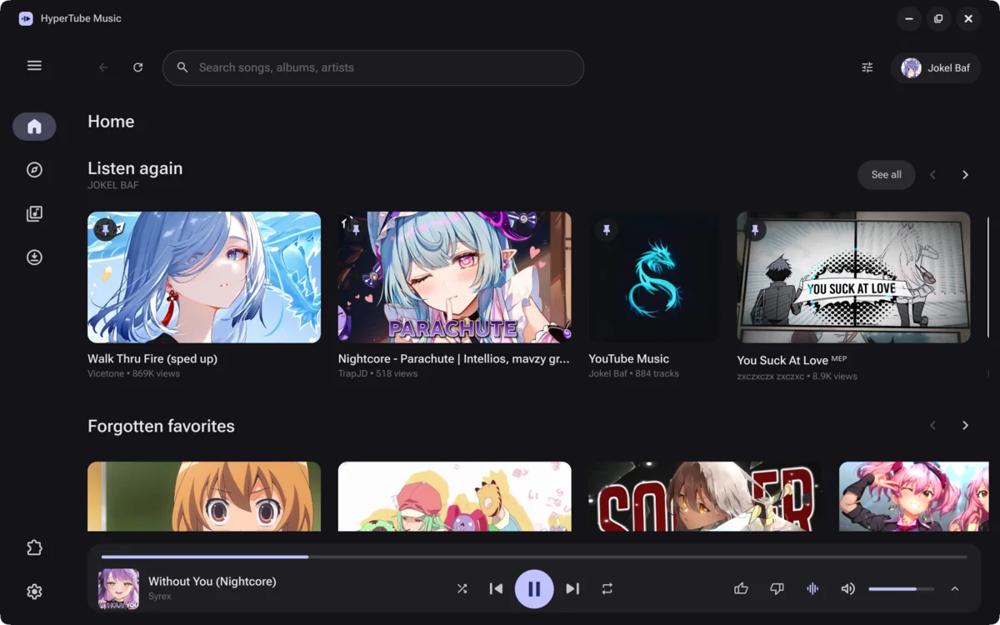
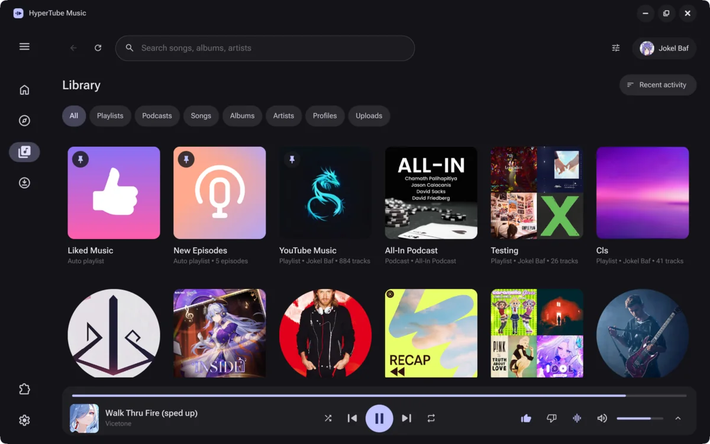
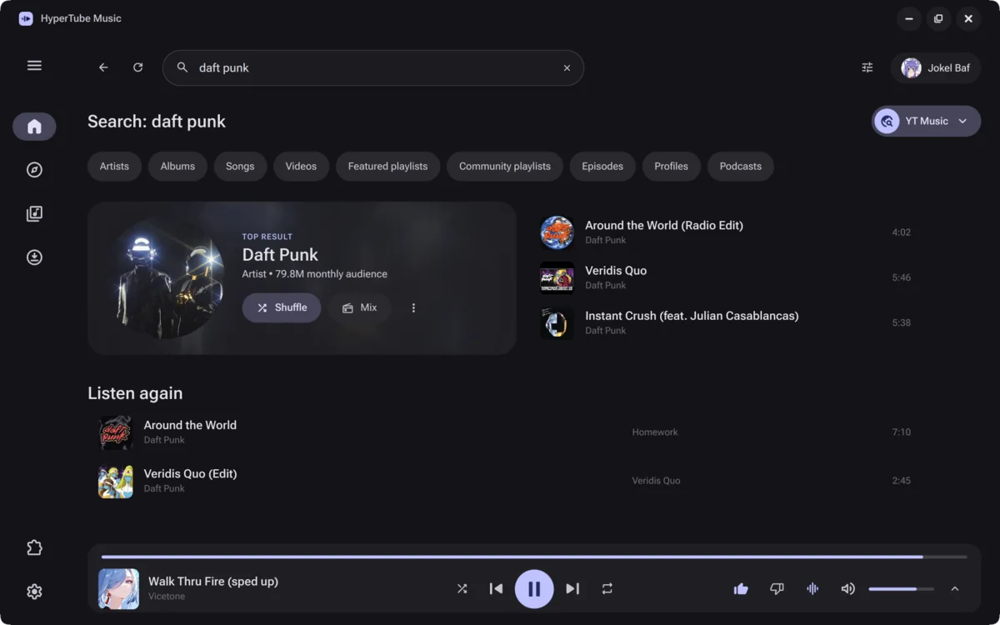
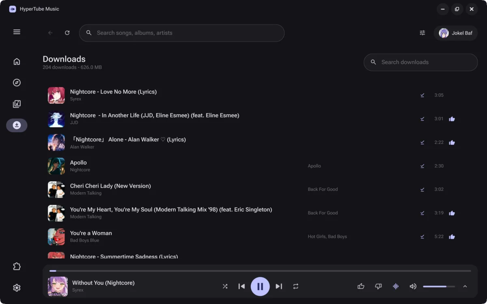

# HyperTube Music

A truly native YouTube Music client for Linux, Windows and macOS.

<table>
  <tr>
    <td></td>
    <td></td>
  </tr>
  <tr>
    <td></td>
    <td></td>
  </tr>
</table>

## Features

- Fully native: C++20 and Qt Quick, with no Electron and no bundled browser runtime.
- Home, Explore, search with filters, and a library with the same tabs and sort orders as YouTube Music. Like songs, save albums, follow artists, and create, edit and reorder playlists.
- Supports playing, downloading and uploading your own music.
- Podcasts with Episode progress, Episodes for Later, playback speed, and resuming where you left off.
- Music videos and live stations: switch a track between audio and video with one click.
- Smart transitions with gapless playback, crossfade, and beat-aware transitions that can match tempo between tracks.
- Equalizer, loudness normalization, autoplay radio and timed lyrics.
- Offline mode. Download tracks manually or let smart downloads do it for you. With no network, you can still access your downloaded library, playlists and podcasts.
- Material You theming: the app follows your system colors with wide distro support (Quickshell, Matugen, KDE Plasma, Pywal, Wallust, the desktop portal, or the Windows and macOS accent color), or generates a palette from a color you pick.
- Full desktop integration: media keys, a tray icon, MPRIS on Linux and the system media controls on Windows and macOS. The app restores your queue and window between launches.
- Plugins. Built-in, opt-in integrations, starting with Discord Rich Presence.
- Localized in English, Russian and Ukrainian.
- Update notifications, and one-click updates on Windows.

## Development

See [BUILDING.md](BUILDING.md) for instructions on development setup and building the app from source.

## Contributing

We welcome contributions from the community. Please read our [CONTRIBUTING.md](CONTRIBUTING.md) file for guidelines on how to contribute to this project.

## License

This project is licensed under the GNU General Public License v3.0. See the [LICENSE](LICENSE) file for details.
